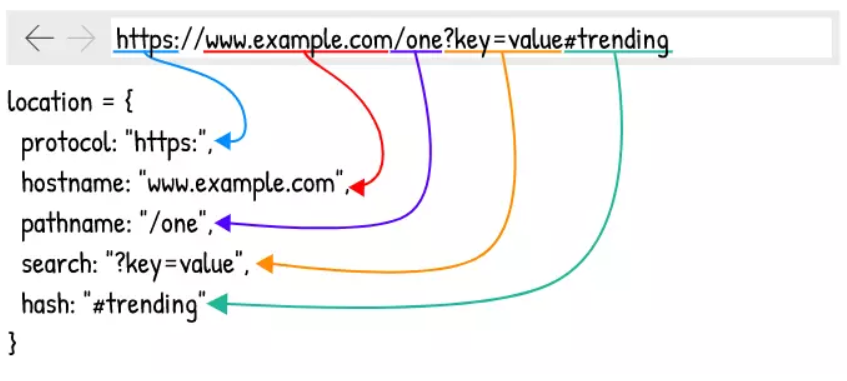

## note-single-page-application
This is some notes about single page application.

### SPA - Single-Page Application
Toàn bộ ứng dụng web chỉ có một trang duy nhất, đây là trang **root**, các trang web hay thành phần khác sẽ được render lên trên trang **root** này. Về cơ bản, SPA được xây dựng dựa trên công cụ và cơ chế có sẳn trên trình duyệt

### Phân loại SPA theo cơ chế điều hướng
Điều hướng là điều mà website nào cũng phải có, có 2 cơ chế chính để điều hướng với một SPA:
1. Ứng dụng có cơ chế điều hướng riêng (**internal state**), dựa vào trang root của nó
2. **location-based SPA**, điều hướng dựa trên URL (phổ biến hơn)

Dễ thấy với cơ chế 1, khó lòng một user có thể tìm thấy được một nội dung dễ dàng, họ buộc phải truy cập từng bước thì mới có thể xem được.

Cơ chế 2 thì phổ biến hơn vì nó dựa vào URL, từ đó bóc tách ra thông tin cần thiết để hiển thị nội dung ra cho người dùng

### window.location

**window.location** giúp bóc tách URL ra thành các thành phần trên. Trên đây, ta chỉ quan tâm đến **pathname**, **search** và **key**

### e.preventDefault()
Ngăn việc điều hướng mặc địch của trình duyệt khi click vào một đường dẫn (thường là thẻ a)

### Tab Browser, Browser Context, Session History, Location Entry

Hình trên mô tả mối liên hệ giữa:
1. Tab Browser: tab của trình duyệt
2. Browser Context
3. Session History: nơi quản lý các entry
4. Location Entry: các entry, mỗi entry bao gồm URL, State và Document (chứa cây DOM)

### cơ chế navigation của browser

để dễ theo dõi ta tự định nghĩa:
- **link mới**: link mà người dùng chưa từng truy cập trong một lần duyệt web trên một tab
- **link cũ**: link mà người dùng đã truy cập trong một lần duyệt web trên một tab

