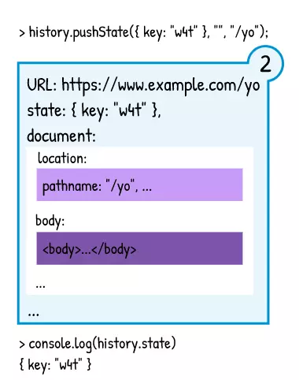

## Giới thiệu
Ghi chú ngắn gọn về SPA gom nhặt từ internet :)

## SPA - Single-Page Application
Toàn bộ ứng dụng web chỉ có một trang duy nhất, đây là trang **root**, các trang web hay thành phần khác sẽ được render lên trên trang **root** này. Về cơ bản, SPA được xây dựng dựa trên công cụ và cơ chế có sẳn trên trình duyệt.

## Phân Loại SPA Theo Cơ Chế Điều Hướng
Điều hướng là điều mà website nào cũng phải có, có 2 cơ chế chính để điều hướng với một SPA:
1. Ứng dụng có cơ chế điều hướng riêng (**internal state**), dựa vào trang root của nó
2. **location-based SPA**, điều hướng dựa trên URL (phổ biến hơn)

Dễ thấy với cơ chế 1, khó lòng một user có thể tìm thấy được một nội dung dễ dàng, họ buộc phải truy cập từng bước thì mới có thể xem được.

Cơ chế 2 thì phổ biến hơn vì nó dựa vào URL, từ đó bóc tách ra thông tin cần thiết để hiển thị nội dung ra cho người dùng.

## window.location

**window.location** giúp bóc tách URL ra thành các thành phần trên. Trên đây, ta chỉ quan tâm đến **pathname**, **search** và **key**

## e.preventDefault()
Ngăn việc điều hướng mặc địch của trình duyệt khi click vào một đường dẫn (thường là thẻ a)

## Tab Browser, Browser Context, Session History, Location Entry

Hình trên mô tả mối liên hệ giữa:
1. **Tab Browser**: tab của trình duyệt
2. **Browser Context**
3. **Session History**: nơi quản lý các entry
4. **Location Entry**: các entry, mỗi entry bao gồm **URL**, **State** và **Document** 

## Document là gì trong một Entry?

Thực chất **document** là một **object**, **object** này mô tả DOM của trang và các method có trên trang đó.

**window.document** là hàm dùng để tương tác với **document** của **entry** hiện tại

Hình bên dưới mô tả cơ chế request của browser tới server để lấy **document tương ứng với entry hiện tại**

## Cơ Chế Navigation Của Browser

#### Trường hợp 1 - Khi user click vào một link
Tab browser sẽ **push vào session history** một **entry mới**. Mỗi navigate sẽ tạo một request tới server để tạo một entry mới bao gồm một Document tương ứng

#### Trường hợp 2 - Khi user click vào nút ''back''' trên trình duyệt
Browser sẽ sử dụng entry hiện tại để xác định entry mới (current.index -1). Document của entry mới (entry trước đó) sẽ được load lại.

Tương tự với nút forward

#### Trường hợp 3 - Sau khi user click vào nút ''back''' trên trình duyệt để lùi về trang trước và click vào một link
Lúc này, các entry nào nằm phía sau entry hiện tại (những trang trước khi back về) sẽ bị xóa và thay bởi entry mới.

#### Trường hợp 4 - Khi user click vào link đúng với link hiện tại (có cùng pathname, search và hash với location hiện tại)
Khi navigate tới đúng link hiện tại, entry hiện tại sẽ bị thay thế mà không ảnh hưởng gì tới các entry khác.

## Cơ Chế Navigation Trong Một SPA
Hiện nay, các SPA sử dụng một bộ các API (đại khái là một bộ các hàm) được cung cấp sẳn là **window.history**. Ở đây ta chỉ quan tâm ba hàm chính: **pushState()**, **replaceState()** và **go()**

Hình phía dưới mô tả đơn giản về hàm **pushState()**

#### pushState()
Cơ bản thì **pushState()** sẽ thêm một entry vào session history phía sau entry hiện tại. Cơ chế này cũng giống như cơ chế navigation của browser khi ta click vào một link như đã nói ở trên.

**pushState()** có 3 tham số theo thứ tự lần lượt:
- **state**: thường là null, ta sẽ nói về nó ở phần sau
- **title**: không mấy quan trọng, thường là ""
- **path**: địa chỉ mà ta muốn navigate tới. Đây có thể là một URL đầy đủ, hoặc là một relative path. **Phải thuộc cùng chung protocol và hostname với entry hiện tại**

#### replaceState()
**replaceState()** sẽ thay thế entry mới với chính entry hiện tại trong session history. Các entry khác đều không bị ảnh hưởng. 

Cơ chế này tương tự với cơ chế được nhắc tới ở trên - click một đường link với href giống hệt URL hiện tại. Nhưng **replaceState()** khác ở chỗ nó cho phép thay thế entry hiện tại với bất kì một location mới nào.

**replaceState()** có tham số y như pushState()

#### go()
hàm **go()** là một cách để mô phỏng lại 2 nút back và foward của trình duyệt.

Ngoài ra còn có 2 hàm **history.back()** và **history.foward()** - chúng tương đương với history.go(-1) và history.go(1)

**go()** nhận một tham số. Dưới đây là ví dụ: 
>go(-1); // back 1 lần
go(1); // forward tiến tới 1 trang
go(-10); // back lại 10 trang
go(0); // reload
go(); // reload
 
## State là gì?
Không phải state kiểu trong react nhá :)

State là dữ liệu (data) gắn với một entry. Nó cố định navigation - có nghĩa là khi bạn thêm 1 state vào một entry, navigate đi, sau đó quay trở lại entry trước, state sẽ vẫn nằm ở đó. **Mặc định khi navigate đến một trang thì state sẽ bằng null**

Dùng **history.state** để truy cập state của entry hiện tại

## Ghi chú
>window.addEventListener('popstate', event => {
  // thông báo cho router biết việc navigate được thực hiện
}, false);

- Hiện nay hầu hết các SPA framework (React, Vue) đều tự xây dựng nên những package riêng của mình cho History API

- Tham khảo https://developer.mozilla.org/en-US/ để biết thêm chi tiết về các **History API**

## Tài liệu tham khảo
- https://blog.pshrmn.com/how-single-page-applications-work/
- https://viblo.asia/p/single-page-app-dieu-khien-history-nhu-the-nao-1VgZvEoMKAw
